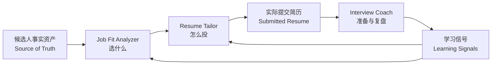

# Career OS

> 一个以事实资产为底座，连接选岗、简历与面试学习的 AI 求职工作流系统。

**Job Fit Analyzer｜选什么**  
**Resume Tailor｜怎么投**  
**Interview Coach｜怎么准备、复盘并让下一场更好**

*Evidence-governed AI workflow for career decisions, applications and interview learning.*

> 本仓库为 **Public Edition**。所有候选人、公司、岗位、数字、简历与面试内容均为 Synthetic Demo，不包含任何真实个人或招聘数据。

▶ [3分钟查看完整 Synthetic Demo](demo/README.md)

## 01｜为什么做 Career OS

普通的 AI 求职对话经常有五个断点：

- 每次换岗位，都要重新向 AI 解释“我是谁”；
- 为了让表达更好看，AI 容易扩大经历、数字或个人责任（Ownership）；
- 选岗、简历和面试各自生成，彼此不共享决策依据；
- “我能不能胜任”和“我是否真的想去”常被混成一个匹配度；
- 一场真实面试结束后，暴露的问题无法沉淀到下一场准备。

Career OS 的思路是：先建立可追溯的 Candidate Evidence / Source of Truth，再让不同 Runtime 在同一事实边界内做决策。

## 02｜Career OS 是什么



系统将“事实维护、岗位决策、简历呈现、面试学习”分层管理。下游可以选择和翻译事实，但不能反向创造事实。完整说明见 [Overall Architecture](docs/architecture.md)。

## 03｜三个核心模块

### Job Fit Analyzer｜有限名额应该投什么

- Eligibility｜能不能投
- Candidate→Job Fit｜现有Evidence能否覆盖岗位
- Competitiveness｜现实筛选中凭什么赢
- Job→Candidate Fit｜拿到以后是否愿意去
- Portfolio Optimization｜有限志愿如何组合与排序

[查看公开Runtime](skills/job-fit-analyzer/README.md)

### Resume Tailor｜确定岗位后如何呈现自己

从已确认Evidence中完成Evidence Selection、Safe Translation、Ownership Guardrail，以及Review Draft → Submission Draft的两阶段收敛。Resume是派生输出，不是Source of Truth。

[查看公开Runtime](skills/resume-tailor/README.md)

### Interview Coach｜如何准备并让下一场更好

围绕实际提交Resume建立Question Map与Answer Preparation；通过Dynamic Mock、Raw Debrief、Story Readiness、Weakness Ledger和Learning Migration，把一次面试变成下一场可复用的学习资产。

[查看公开Runtime](skills/interview-coach/README.md)

## 04｜3分钟 Synthetic Demo

虚构的**候选人A（Candidate A）**面对**D公司（Company Delta）**的四个岗位：

- 战略分析岗（Strategy Analyst）
- 风险分析岗（Risk Analyst）
- 产品分析岗（Product Analyst）
- 数据分析岗（Data Analyst）

推荐阅读顺序：[候选人与岗位](demo/README.md) → [Job Fit](demo/01_job_fit/portfolio_recommendation.md) → [Resume Tailoring](demo/02_resume_tailoring/decision_log.md) → [Interview Coach](demo/03_interview_coach/question_map.md)。

### Demo：Job Fit

| 岗位 | 结果 | 核心原因 |
|---|---|---|
| 战略分析岗（Strategy Analyst） | P1｜Core Target | 研究Evidence最直接，偏好与竞争路径一致 |
| 风险分析岗（Risk Analyst） | P2｜Strong Complement | 调用规则与数据质量Evidence，形成不同筛选路径 |
| 产品分析岗（Product Analyst） | Not selected | Evidence以Adjacent / Transferable为主 |
| 数据分析岗（Data Analyst） | Conditional | SQL、编程与建模缺少Evidence支持，属于明确的Technical Gap |

这不是关键词相似度排序，而是在有限名额下综合Evidence、竞争力、偏好与组合风险。

### Demo：Resume Tailoring

`Canonical Evidence → Selected Evidence → Safe Translation → Tailored Resume`

同一条经历可以被安全翻译为岗位语言，但Ownership、Result Scope与Technical Depth不能被升级。查看[Evidence选择结果](demo/02_resume_tailoring/tailored_evidence_selection.md)。

### Demo：Interview Coach

`Question Map → Answer Preparation → Mock → Prepared vs Actual vs Better → Learning Migration`

参考答案用于练习结构，不是新的Candidate Fact；真实面试复盘先保存Raw Record，再进行Diagnosis。查看[Answer Preparation示例](demo/03_interview_coach/answer_preparation.md)与[Learning Migration](demo/03_interview_coach/learning_migration.md)。

## 05｜重点治理的 AI 风险

- **事实幻觉（Hallucination）**：AI不能新增Candidate事实、数字或技术能力。
- **责任膨胀（Ownership Inflation）**：团队结果不会自动升级为个人成果。
- **证据漂移（Evidence Drift）**：下游输出必须回溯到稳定Evidence ID。
- **上下文割裂（Context Fragmentation）**：三个Runtime读取同一Source of Truth。
- **反馈流失（Feedback Loss）**：面试学习进入Learning Loop，而不是停留在一次对话中。

## 06｜核心设计原则

1. **事实优先于表达（Facts before fluency）**
2. **Source of Truth优先于Derived Output**
3. **Direct / Adjacent / Transferable不能混用**
4. **Unknown也是合法输出**
5. **Review先于Compression**
6. **准备答案，但不替Candidate编造身份**
7. **学习可以迁移，但不能无控制修改事实**

更多说明见[Design Principles](docs/design_principles.md)与[Data Governance](docs/data_governance.md)。

## 07｜项目结构

```text
Career_OS_V1_Public_Edition/
├── docs/                 # 架构与治理
├── skills/               # 三个Public Runtime Specification
├── demo/                 # 端到端Synthetic Demo
├── screenshots/          # 后续Synthetic视觉资产
└── assets/architecture/  # 架构图资产
```

## 08｜Development Journey

`V0 Runtime → Scenario Testing → Guardrail Patches → V1 Production → Public Edition`

选岗与简历Runtime经过真实招聘场景迭代验证；Interview Runtime在正式冻结前通过受控Synthetic Scenario测试。公开版随后通过Clean-room Export与Privacy Scan建立。

详见[Public Changelog](CHANGELOG.md)。

## 09｜Explore

1. [Overall Architecture](docs/architecture.md)
2. [End-to-end Demo](demo/README.md)
3. [Three Runtime Modules](skills/README.md)
4. [Data / Evidence Governance](docs/data_governance.md)
5. [Development Journey](CHANGELOG.md)
