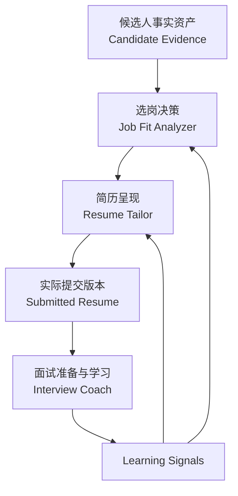

# 整体架构（Overall Architecture）

Career OS将事实、决策、呈现与学习分层，避免一次AI输出同时承担“事实库、判断器和最终文案”三种职责。

## 分层结构

| Layer | 主要职责 | Mutation Boundary |
|---|---|---|
| Source of Truth | 保存已确认事实、Evidence、Ownership与Preference | 只能通过受治理的事实整理更新 |
| Job Decision | 判断Eligibility、Fit、Competitiveness与Portfolio | 产出决策和Handoff，不创造事实 |
| Resume Runtime | 选择并翻译岗位相关Evidence | 不得写入Unsupported Claim |
| Interview Runtime | 准备、训练、记录、复盘与迁移学习 | 跨模块发现只能生成Review Signal |
| Derived Output | Job Analysis、Resume、Answer Pack等 | 永远不能覆盖Source of Truth |

## 三个模块的边界

- **Job Fit Analyzer：投什么**
- **Resume Tailor：怎么投**
- **Interview Coach：怎么准备、复盘并迁移学习**

这种分层让同一Candidate Evidence可以被不同岗位安全调用，同时保留事实边界与版本历史。
