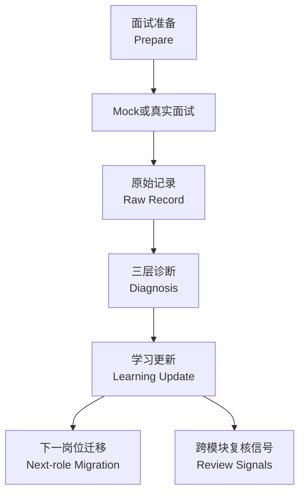

# 面试学习闭环（Learning Loop）

Interview Learning需要同时尊重Evidence与Context。

## 核心规则

- 先保存Raw Recollection，再做Interpretation。
- Observable Reaction与Candidate Interpretation分开保存。
- Prepared Answer、Actual Answer与Better Structure互不覆盖。
- 一次弱回答不会直接创建长期Weakness。
- `repeated_count`按独立Context计算，不按同一场面试的问题数量计算。
- Learning按相关性迁移：Career Narrative可以跨岗位继承，岗位特有Knowledge Gap可能被丢弃。
- 面向其他模块的发现只形成Review Signal，不自动修改下游资产。

## Feedback Router

- `interview_layer_only`
- `resume_tailor_feedback`
- `job_fit_analyzer_role_signal`
- `candidate_core_review`
- `experience_curator_review`
